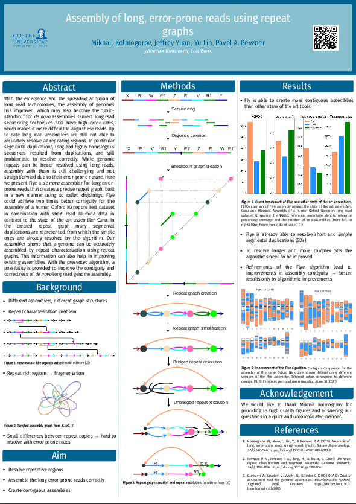
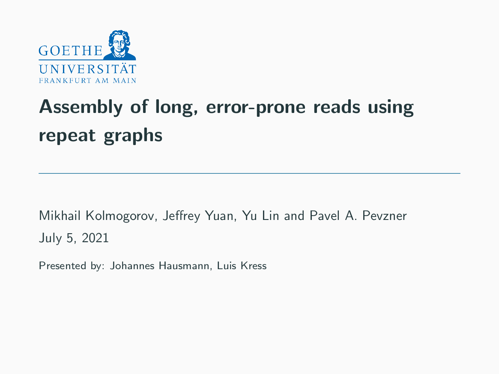

# Algorithmen der Sequenzanalyse Seminar

---

We are presenting the article "Assembly of long, error-prone reads using repeat graphs" by Mikhail Kolmogorov, Jeffrey Yuan, Yu Lin and Pavel A Pevzner published in May 2019.

## Poster

Our poster can be downloaded here: https://github.com/LKress/ASA/blob/main/poster/poster.pdf

## Presentation

Our presentation can be downloaded here: https://github.com/LKress/ASA/blob/main/presentation/presentation_final.pdf

## Manual

### Compile documents

Required software: 

* pandoc 
* brave or chromium (if you want to use chromium please make sure to adapt the Makefile)
* python3 and matplotlib 
* LaTeX or XeLaTeX distribution
* [Metropolis](https://github.com/matze/mtheme)
* [Posterdown](https://github.com/brentthorne/posterdown)

There are the following commands to compile/create the needed documents:

* `make plot` creates the result plot

* `make ppt` compiles the presentation

* `make post` compiles the poster

* `make all` to compile everything

### Figures

The figures on the poster and the presentation were created using [drawio](https://app.diagrams.net/) and are modified from the paper of Kolmogorov et al. 2019.
