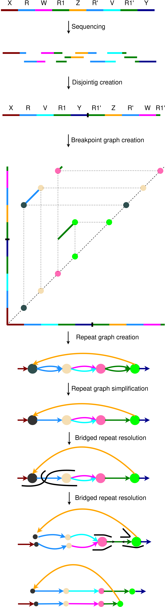
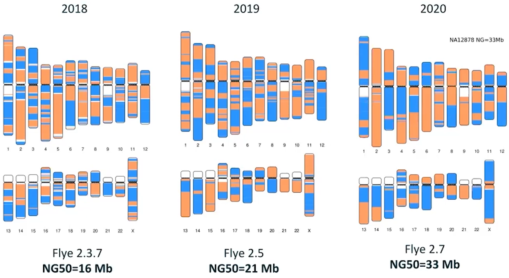

# Abstract

With the emergence and the spreading adoption of long-read technologies, the assembly
of genomes has improved, which may also become the "gold-standard" for de novo assemblies. Current long read sequencing techniques still have high error rates which makes it more difficult to align these reads. Up to date long read assemblers are still not able to resolve all repeating regions correctly. Especially segmental duplications, long and highly homologous sequences resulted from duplications, are still problematic to resolve correctly. While genomic repeats can be better resolved using long reads, assembly with them is still challenging and not straightforward due to their error-prone nature. Here we present Flye a de novo assembler for long-error prone reads, by creating a precise repeat graph, built in a new manner using so called disjointigs. Flye could achive two times better contiguity for the assembly of a human Oxford Nanopore test dataset in combination with short read Illumina data in contrast to the state of the art assembler Canu. In the created repeat graph many segmental duplications are represented from which the simple ones are already resolved by the algorithm. Our assembler shows that a genome can be accurately assembled by repeat characterization using repeat graphs. This information can also help in improving existing assemblies. With the presented algorithm, a
possibility is provided to improve the de novo assembly of a genome.

# Background

* SD

{ width=100% }

* assembly graph is tangled if SD/mosaic repeats are assembled

{ width=60% }

* small differences between repeat copies are harder to resolve using error prone-reads

# Forschungsfrage/Aim

* generate an algorithm, which is able to:
    
    * resolve repeating regions

    * assemble the long error-prone reads correctly

    * create contiguous assemblies

# Methods

{ width=100% }

# Results

{ width=100% }

# References

