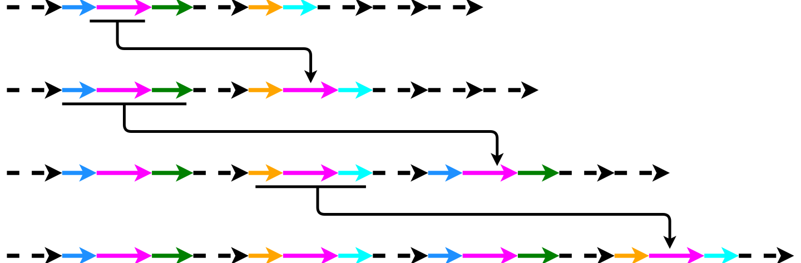
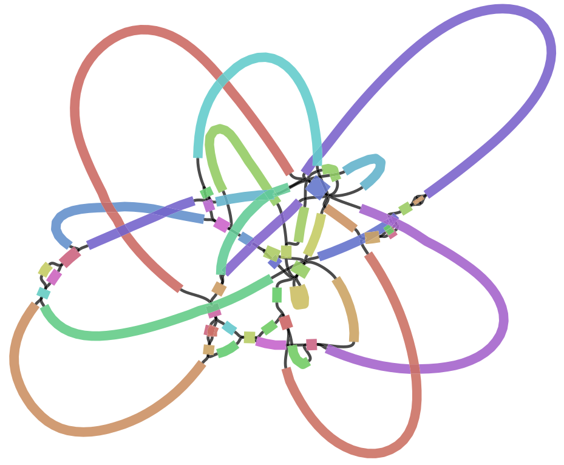

# Abstract

With the emergence and the spreading adoption of long-read technologies, the assembly
of genomes has improved, which may also become the "gold-standard" for <i>de novo</i> assemblies. Current long read sequencing techniques still have high error rates, which makes it more difficult to align these reads. Up to date long read assemblers are still not able to accurately resolve all repeating regions. In particular segmental duplications, long and highly homologous sequences resulted from duplications, are still problematic to resolve correctly. While genomic repeats can be better resolved using long reads, assembly with them is still challenging and not straightforward due to their error-prone nature. Here we present Flye a <i>de novo</i> assembler for long error-prone reads, by creating a precise repeat graph, built in a new manner using so called disjointigs. Flye could achieve two times better contiguity for the assembly of a human Oxford Nanopore test dataset in combination with short read Illumina data in contrast to the state of the art assembler Canu. In the created repeat graph many segmental duplications are represented, from which the simple ones are already resolved by the algorithm. Our assembler shows that a genome can be accurately assembled by repeat characterization using repeat graphs. This information can also help in improving existing assemblies. With the presented algorithm, a
possibility is provided to improve the contiguity and correctness of <i>de novo</i> long read genome assembly.

# Background

* Different assemblers, different graph structures

* repeat characterization problem

{ width=100% }

<b>Figure 1. Repeat formation.</b> How mosaic-like repeats arise (modified from [2])

* Repeat rich regions $\rightarrow$ fragmentation

{ width=40% }

<b>Figure 2. Tangled assembly graph from <i>E.coli.</i></b> [1]

* Small differences between repeat copies → hard to resolve with error-prone reads

# Aim
    
* resolve repetetive regions

* assemble the long error-prone reads correctly

* create contiguous assemblies

# Methods

{ width=100% }

<b>Figure 3. Repeat graph creation and repeat resolution.</b> (modified from [1])

# Results

* Fly is able to create more contiguous assemblies than other state of the art tools

{width=100%}

<b>Figure 4. Quast benchmark of Flye and other state of the art assemblers.</b> [3] Comparison of Flye assembly against the state of the art assemblers Canu and Masurca. Assembly of a human Oxford Nanopore long read dataset. Comparing the NGA50, reference percentage identity, reference percentage coverage and the number of missassemblies (from left to right). (Own figure from data of table 1 [1]) 

* Flye is already able to resolve short and simple segmental duplications (SDs) 

* To resolve longer and more complex SDs the algorithms need to be improved  

* Refinements of the Flye algorithm lead to improvements in assembly contiguity $\rightarrow$ better results only by algorithmic improvements

{width=49%}
{width=49%}

<b>Figure 5: Improvement of the Flye algorithm.</b> Contiguity comparison for the assembly of the same Oxford Nanopore human dataset using different versions of the Flye assembler. Different colors correspond to different contigs. (M. Kolmogorov, personal communication, June 30, 2021)

# Acknowledgement

We would like to thank Mikhail Kolmogorov for providing us high quality figures and answering our questions in a quick and uncomplicated manner.

# References

1. Kolmogorov, M., Yuan, J., Lin, Y., & Pevzner, P. A. (2019). Assembly of long, error-prone reads using repeat graphs. <i>Nature Biotechnology, 37(5),</i> 540-546. https://doi.org/10.1038/s41587-019-0072-8

2. Pevzner, P. A., Pevzner, P. A., Tang, H., & Tesler, G. (2004). <i>De novo</i> repeat classification and fragment assembly. <i>Genome Research, 14(9),</i> 1786-1796. https://doi.org/10.1101/gr.2395204

3. Gurevich, A., Saveliev, V., Vyahhi, N., & Tesler, G. (2013). QUAST: Quality assessment tool for genome assemblies. <i>Bioinformatics (Oxford, England), 29(8),</i> 1072-1075. https://doi.org/10.1093/\-bioinformatics/btt086

